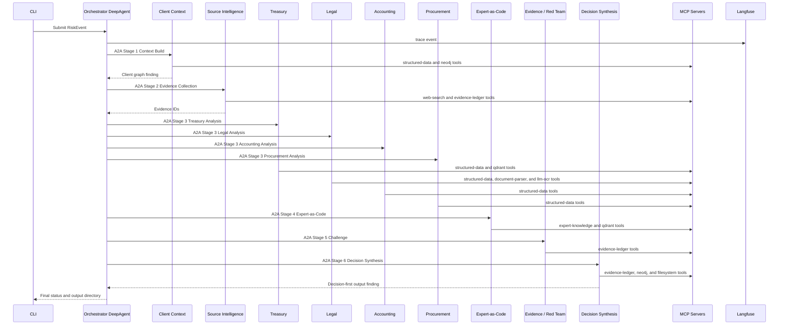
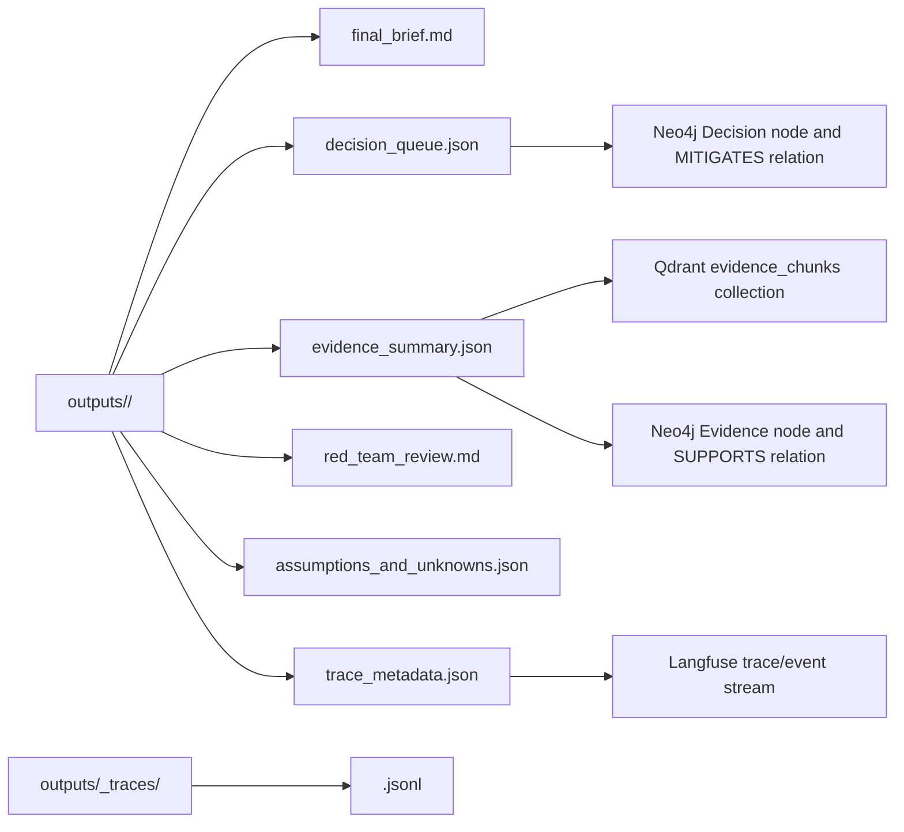

# Risk Advisory Intelligence Platform Architecture Diagrams

This document shows the implemented target architecture. The legacy local PoC path remains only for compatibility tests and is not the normal final execution path.

## 1. Target Runtime Architecture

```mermaid
flowchart TB
    user["CLI / API Caller"] --> orch["Orchestrator DeepAgent"]

    subgraph a2a["A2A Agent Layer"]
        orch
        src["Source Intelligence DeepAgent"]
        ctx["Client Context DeepAgent"]
        treasury["Treasury Risk DeepAgent"]
        legal["Legal Risk DeepAgent"]
        accounting["Accounting Risk DeepAgent"]
        procurement["Procurement Risk DeepAgent"]
        expert["Expert-as-Code DeepAgent"]
        redteam["Evidence / Red Team DeepAgent"]
        decision["Decision Synthesis DeepAgent"]
    end

    orch -- "A2A task request" --> ctx
    orch -- "A2A task request" --> src
    orch -- "A2A task request" --> treasury
    orch -- "A2A task request" --> legal
    orch -- "A2A task request" --> accounting
    orch -- "A2A task request" --> procurement
    orch -- "A2A task request" --> expert
    orch -- "A2A task request" --> redteam
    orch -- "A2A task request" --> decision

    subgraph mcp["FastMCP Server Layer"]
        web["mcp-web-search / Tavily"]
        parser["mcp-document-parser / Docling-first fallback chain"]
        ocr["mcp-llm-ocr / OpenRouter vision OCR"]
        qdrant_mcp["mcp-qdrant"]
        neo4j_mcp["mcp-neo4j"]
        filesystem["mcp-filesystem"]
        structured["mcp-structured-data"]
        expert_mcp["mcp-expert-knowledge"]
        ledger["mcp-evidence-ledger"]
    end

    src -- "MCP tool call" --> web
    src -- "MCP tool call" --> ledger
    ctx -- "MCP tool call" --> structured
    ctx -- "MCP tool call" --> neo4j_mcp
    treasury -- "MCP tool call" --> structured
    treasury -- "MCP tool call" --> qdrant_mcp
    legal -- "MCP tool call" --> structured
    legal -- "MCP tool call" --> parser
    legal -- "MCP tool call" --> ocr
    accounting -- "MCP tool call" --> structured
    procurement -- "MCP tool call" --> structured
    expert -- "MCP tool call" --> expert_mcp
    redteam -- "MCP tool call" --> ledger
    decision -- "MCP tool call" --> ledger
    decision -- "MCP tool call" --> neo4j_mcp
    decision -- "MCP tool call" --> filesystem

    subgraph stores["Stores and External Services"]
        tavily["Tavily API"]
        openrouter["OpenRouter API / model profiles"]
        qdrant["Qdrant Vector Store"]
        neo4j["Neo4j Client Asset Graph"]
        files["outputs/<scenario_id>/ artifacts"]
        data["data/clients and data/expert_knowledge"]
        langfuse["Self-hosted Langfuse"]
    end

    web --> tavily
    qdrant_mcp --> qdrant
    ledger --> qdrant
    ledger --> neo4j
    neo4j_mcp --> neo4j
    structured --> data
    expert_mcp --> data
    expert_mcp --> qdrant
    filesystem --> files

    orch --> openrouter
    src --> openrouter
    treasury --> openrouter
    legal --> openrouter
    accounting --> openrouter
    procurement --> openrouter
    expert --> openrouter
    redteam --> openrouter
    decision --> openrouter

    orch -. "trace_id" .-> langfuse
    src -. "trace_id" .-> langfuse
    ctx -. "trace_id" .-> langfuse
    treasury -. "trace_id" .-> langfuse
    legal -. "trace_id" .-> langfuse
    accounting -. "trace_id" .-> langfuse
    procurement -. "trace_id" .-> langfuse
    expert -. "trace_id" .-> langfuse
    redteam -. "trace_id" .-> langfuse
    decision -. "trace_id" .-> langfuse
```

## 2. Docker Compose Topology

```mermaid
flowchart TB
    subgraph agents["Agent Containers"]
        o["orchestrator-agent:8100"]
        s["source-intelligence-agent:8101"]
        c["client-context-agent:8102"]
        t["treasury-risk-agent:8103"]
        l["legal-risk-agent:8104"]
        a["accounting-risk-agent:8105"]
        p["procurement-risk-agent:8106"]
        e["expert-as-code-agent:8107"]
        r["evidence-redteam-agent:8108"]
        d["decision-synthesis-agent:8109"]
    end

    subgraph mcps["MCP Containers"]
        mw["mcp-web-search:8201"]
        md["mcp-document-parser:8202"]
        mo["mcp-llm-ocr:8203"]
        mq["mcp-qdrant:8204"]
        mn["mcp-neo4j:8205"]
        mf["mcp-filesystem:8206"]
        ms["mcp-structured-data:8207"]
        me["mcp-expert-knowledge:8208"]
        ml["mcp-evidence-ledger:8209"]
    end

    subgraph backing["Backing Services"]
        q["qdrant:6333"]
        n["neo4j:7687"]
        lf["langfuse:3000 / host 3300"]
        pg["langfuse-postgres"]
        ch["langfuse-clickhouse"]
        rd["langfuse-redis"]
        minio["langfuse-minio"]
    end

    o --> s
    o --> c
    o --> t
    o --> l
    o --> a
    o --> p
    o --> e
    o --> r
    o --> d

    s --> mw
    s --> ml
    c --> ms
    c --> mn
    t --> ms
    t --> mq
    l --> ms
    l --> md
    l --> mo
    a --> ms
    p --> ms
    e --> me
    r --> ml
    d --> ml
    d --> mn
    d --> mf

    mq --> q
    me --> q
    ml --> q
    mn --> n
    ml --> n
    lf --> pg
    lf --> ch
    lf --> rd
    lf --> minio
```

## 3. Scenario Execution Flow

## 4. Output Artifact Map

