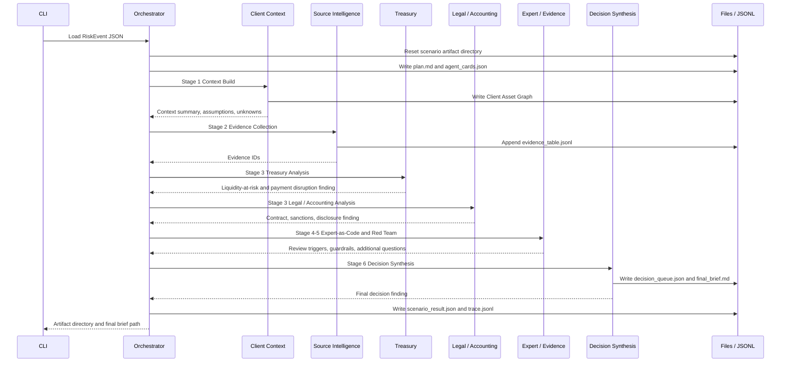

# Risk Advisory Intelligence Platform Architecture Diagrams

このファイルは、設計書のターゲット構成と、現時点で実装済みのUIなしローカルPoC構成を分けて示す。

## 1. Target Architecture

```mermaid
flowchart TB
    user["User / Consultant UI"] --> api["Thin Backend / API Gateway"]
    api --> orch["Orchestrator DeepAgent"]

    subgraph a2a["A2A Agent Layer"]
        orch
        src["Source Intelligence Agent"]
        ctx["Client Context Agent"]
        tr["Treasury Risk Agent"]
        la["Legal / Accounting Agent"]
        pr["Procurement Risk Agent"]
        exp["Expert-as-Code Agent"]
        red["Evidence / Red Team Agent"]
        dec["Decision Synthesis Agent"]
    end

    orch -- "A2A task" --> src
    orch -- "A2A task" --> ctx
    orch -- "A2A task" --> tr
    orch -- "A2A task" --> la
    orch -- "A2A task" --> pr
    orch -- "A2A task" --> exp
    orch -- "A2A task" --> red
    orch -- "A2A task" --> dec

    subgraph mcp["MCP Tool / Connector Layer"]
        web["mcp-web-search"]
        parser["mcp-document-parser"]
        ocr["mcp-llm-ocr"]
        qdrant_mcp["mcp-qdrant"]
        neo4j_mcp["mcp-neo4j"]
        fs_mcp["mcp-filesystem"]
        structured["mcp-structured-data"]
        expert_mcp["mcp-expert-knowledge"]
        evidence_mcp["mcp-evidence-ledger"]
    end

    src -- "MCP" --> web
    ctx -- "MCP" --> parser
    ctx -- "MCP" --> qdrant_mcp
    ctx -- "MCP" --> neo4j_mcp
    tr -- "MCP" --> structured
    tr -- "MCP" --> qdrant_mcp
    la -- "MCP" --> parser
    la -- "MCP" --> ocr
    pr -- "MCP" --> structured
    exp -- "MCP" --> expert_mcp
    red -- "MCP" --> evidence_mcp
    dec -- "MCP" --> fs_mcp

    subgraph data["Data Layer"]
        client_data["Client Structured Data / Documents"]
        files["Files / JSONL Scenario Artifacts"]
        qdrant["Qdrant Vector Store"]
        neo4j["Neo4j Client Asset Graph"]
        expert_store["Expert Knowledge Store"]
        ledger["Evidence / Scenario Delta Ledger"]
    end

    structured --> client_data
    parser --> client_data
    fs_mcp --> files
    qdrant_mcp --> qdrant
    neo4j_mcp --> neo4j
    expert_mcp --> expert_store
    evidence_mcp --> ledger

    subgraph external["External Services"]
        openrouter["OpenRouter API"]
        qwen["Qwen / Other Model Profiles"]
        sources["Government / News / Sanctions / Market Sources"]
    end

    orch --> openrouter
    src --> openrouter
    tr --> openrouter
    la --> openrouter
    exp --> openrouter
    red --> openrouter
    dec --> openrouter
    openrouter --> qwen
    web --> sources

    subgraph obs["Observability"]
        langfuse["Langfuse Traces"]
    end

    orch --> langfuse
    src --> langfuse
    ctx --> langfuse
    tr --> langfuse
    la --> langfuse
    pr --> langfuse
    exp --> langfuse
    red --> langfuse
    dec --> langfuse
```



## 2. Current UI-less PoC Architecture

```mermaid
flowchart TB
    cli["CLI: run-scenario"] --> input["Scenario Input JSON"]
    input --> orch["OrchestratorDeepAgent"]

    subgraph local_a2a["Local A2A Registry"]
        ctx["ClientContextAgent"]
        src["SourceIntelligenceAgent"]
        tr["TreasuryRiskAgent"]
        la["LegalAccountingAgent"]
        exp["ExpertEvidenceAgent"]
        dec["DecisionSynthesisAgent"]
    end

    orch --> ctx
    orch --> src
    orch --> tr
    orch --> la
    orch --> exp
    orch --> dec

    subgraph local_mcp["Local MCP-style Tool Boundaries"]
        fs["FilesystemMCP"]
        sd["StructuredDataMCP"]
        sc["SourceCatalogMCP"]
        ek["ExpertKnowledgeMCP"]
        ev["EvidenceLedgerMCP"]
    end

    ctx --> sd
    src --> sc
    src --> ev
    tr --> sd
    tr --> ev
    la --> sd
    la --> ev
    exp --> ek
    exp --> ev
    dec --> fs

    subgraph local_data["Local Data"]
        csv["CSV client extracts"]
        dummy_sources["Dummy external source catalog"]
        rules["Expert rules JSONL"]
        artifacts["Scenario artifacts"]
    end

    sd --> csv
    sc --> dummy_sources
    ek --> rules
    fs --> artifacts
    ev --> artifacts

    subgraph outputs["Scenario Outputs"]
        graph["Client Asset Graph JSON"]
        evidence["Evidence Ledger JSONL"]
        trace["Trace JSONL"]
        queue["Decision Queue JSON"]
        brief["Final Brief Markdown"]
    end

    artifacts --> graph
    artifacts --> evidence
    artifacts --> trace
    artifacts --> queue
    artifacts --> brief

    smoke["CLI: llm-smoke"] --> adapter["OpenRouterClient"]
    adapter --> openrouter["OpenRouter / qwen/qwen3.6-flash"]
```

## 3. Scenario Execution Flow



## 4. Artifact Map

```mermaid
flowchart LR
    scenario["data/scenarios/{scenario_id}"] --> plan["plan.md"]
    scenario --> cards["agent_cards.json"]
    scenario --> context["context_summary.md"]
    scenario --> graph_dir["graph_imports/"]
    graph_dir --> graph["client_asset_graph.json"]
    scenario --> evidence["evidence_table.jsonl"]
    scenario --> treasury["treasury_analysis.md"]
    scenario --> legal["legal_accounting_analysis.md"]
    scenario --> expert["expert_review.md"]
    scenario --> decisions["decision_queue.json"]
    scenario --> brief["final_brief.md"]
    scenario --> trace["trace.jsonl"]
    scenario --> result["scenario_result.json"]
```

