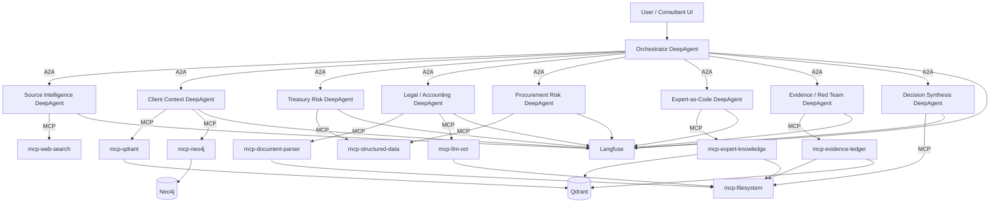
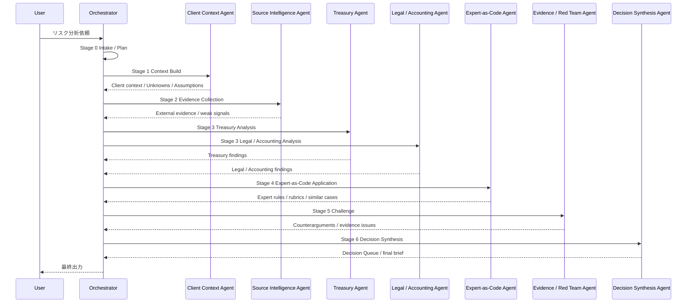

# DeepAgent / A2A / MCPベース リスクアドバイザリーAI アーキテクチャ設計書

作成日: 2026-06-27  
対象: エマージェンシーリスク分析・リスクシナリオ策定・多モード専門分析・Decision-first Outputを実現するAIエージェント基盤

---

## 1. 設計方針

本設計では、初期実装の複雑性を抑えつつ、将来的に本番運用へ移行しやすい構成を採用する。

基本方針は以下である。

1. **Pythonを中心に実装する**  
   Agent、MCP Server、データ処理、スコアリング、Expert-as-Codeの実装はPythonを基本とする。

2. **LangChain DeepAgentsを中核にする**  
   DeepAgentsを、計画、段階的タスク実行、ファイルベースの中間成果管理、サブエージェント活用の中核に置く。DeepAgentsは、複雑な多段階タスクに対して、計画、サブエージェント、ファイルシステム、長期記憶を活用できるエージェント基盤として利用する。

3. **DeepAgentがDeepAgentを呼ぶ構造にする**  
   上位のOrchestrator DeepAgentが、Treasury、Legal、Accounting、Procurement、Expert-as-Code、Evidence / Red TeamなどのDomain DeepAgentにタスクを委任する。

4. **エージェント間通信はA2Aで統一する**  
   Agent-to-Agentの通信、能力発見、タスク依頼、分析結果返却はA2A Protocolに寄せる。各AgentはAgent Cardを持ち、どのような分析ができるかを公開する。

5. **外部接続はMCPで統一する**  
   Web検索、Qdrant、Neo4j、文書パーサー、LLM OCR、ファイルシステム、Expert Knowledge StoreなどはMCP Serverとして公開し、AgentはMCP Clientとして利用する。

6. **OSS中心で構成する**  
   VectorDBはQdrant、GraphDBはNeo4j、監視はセルフホストLangfuse、文書パーサーはDocling等のOSSを中心にする。

7. **LLMはOpenRouter経由でQwen系モデル等を組み合わせる**  
   OpenRouterのOpenAI互換APIを利用し、用途に応じてQwen系モデル、推論向けモデル、軽量モデル、Visionモデルを切り替える。モデル名は固定せず、設定ファイルで差し替え可能にする。

8. **認証・詳細ポリシー制御は初期対象外とする**  
   初期設計では認証、RBAC、Policy as Code、厳密な権限分離は対象外とする。ただし、本番化時に追加できる境界は意識しておく。

9. **本番化を見据えて最初からコンテナ化する**  
   初期はDocker Composeで起動し、将来的には各Agent / MCP ServerをECSタスクまたはECS Serviceへ移行できる構成にする。

---

## 2. アーキテクチャ全体像



---

## 3. レイヤー構成

```text
Application Layer
  - User / Consultant UI
  - API Gateway相当の薄いBackend

Agent Layer
  - Orchestrator DeepAgent
  - Domain DeepAgents
  - A2A communication

Tool / Connector Layer
  - MCP Servers
  - Web Search
  - Document Parser
  - LLM OCR
  - Qdrant Tool
  - Neo4j Tool
  - Structured Data Tool
  - Expert Knowledge Tool
  - Evidence Ledger Tool

Data Layer
  - Qdrant
  - Neo4j
  - Files / JSONL
  - Langfuse

Runtime Layer
  - Docker Compose for local / PoC
  - ECS-compatible containers for production migration
```

---

## 4. A2AとMCPの責務分離

本設計で最も重要なのは、A2AとMCPの役割を混同しないことである。

| 区分 | 役割 | 本設計での用途 |
|---|---|---|
| A2A | Agent同士の通信・能力発見・タスク依頼・結果返却 | OrchestratorがDomain DeepAgentに分析を依頼する |
| MCP | Agentが外部ツール・データ・ワークフローへ接続する標準インターフェース | Web検索、DB検索、文書処理、ファイル操作、Expert Knowledge参照 |

### 4.1 A2Aの使い方

A2Aは、独立したAgentサービス間の通信に使う。

例:

```text
Orchestrator DeepAgent
  → Treasury Risk DeepAgentへA2Aで依頼
  → Legal / Accounting DeepAgentへA2Aで依頼
  → Evidence / Red Team DeepAgentへA2Aでレビュー依頼
```

各Agentは、以下を公開する。

```text
/.well-known/agent-card.json
/a2a
/healthz
```

Agent Cardには、Agentの名称、説明、利用可能な分析スキル、入力スキーマ、出力スキーマ、対応モードを記載する。

### 4.2 MCPの使い方

MCPは、外部接続の統一口として使う。

例:

```text
Treasury Risk DeepAgent
  → mcp-structured-dataでAriba抽出CSVを読む
  → mcp-qdrantで関連文書を検索
  → mcp-neo4jで支払先・契約・サプライヤー関係を探索
```

MCP Serverは、以下を公開する。

```text
/mcp
/healthz
```

---

## 5. DeepAgent構成

## 5.1 2階層構成

DeepAgentの構成は、原則として2階層にする。

```text
Level 1:
  Orchestrator DeepAgent

Level 2:
  Domain DeepAgents
```

A2A上で3階層以上のAgent呼び出しを多用すると、トレース、コスト、遅延、失敗時のリカバリーが複雑になる。そのため、A2A上のAgent呼び出しは基本的に以下に制限する。

```text
Orchestrator → Domain Agent
```

一方、Domain Agent内部ではDeepAgentsのsubagent機能を使ってもよい。

例:

```text
Treasury Risk DeepAgent
  ├─ payment-data-analyzer subagent
  ├─ cash-mobility-scorer subagent
  └─ treasury-output-writer subagent
```

---

## 5.2 Agent一覧

| Agent | 主要責務 |
|---|---|
| Orchestrator DeepAgent | 全体計画、タスク分解、A2A呼び出し、最終統合 |
| Source Intelligence DeepAgent | Web検索、外部リスク情報収集、ソース要約、弱シグナル抽出 |
| Client Context DeepAgent | クライアント文書、取引データ、契約、拠点、サプライヤーの文脈化 |
| Treasury Risk DeepAgent | 資金移動、支払、流動性、銀行・通貨・制裁近接リスク分析 |
| Legal / Accounting DeepAgent | 契約、法令、制裁、通知義務、引当、減損、後発事象、開示論点分析 |
| Procurement Risk DeepAgent | Ariba等の購買・支払データ、サプライヤー、在庫、代替調達分析 |
| Expert-as-Code DeepAgent | 専門家知見、類似ケース、赤旗、ルーブリック、判断ガードレールの適用 |
| Evidence / Red Team DeepAgent | 根拠検証、反証探索、過大評価・過小評価・見落とし指摘 |
| Decision Synthesis DeepAgent | Decision Queue、経営判断メモ、実行タスク、専門家レビュー候補の生成 |

---

## 6. 段階的タスク実行設計

Orchestrator DeepAgentは、ユーザー依頼を受けてすぐに最終回答を生成しない。必ず段階的にタスクを実行する。



### 6.1 Stage定義

| Stage | 名称 | 内容 | 主担当Agent |
|---:|---|---|---|
| 0 | Intake / Plan | ユーザー依頼の解釈、分析モード選択、必要Agent決定 | Orchestrator |
| 1 | Context Build | クライアント文脈、関連アセット、Unknown / Assumption整理 | Client Context |
| 2 | Evidence Collection | Web検索、公開情報、既存文書、証拠候補収集 | Source Intelligence |
| 3 | Mode Analysis | Treasury、Legal、Accounting、Procurement等の専門分析 | Domain Agents |
| 4 | Expert-as-Code | 類似ケース、赤旗、ルーブリック、表現制御、レビュー要否補正 | Expert-as-Code |
| 5 | Challenge | 反証、過大評価、過小評価、根拠不足、別解検討 | Evidence / Red Team |
| 6 | Decision Synthesis | 判断事項、担当、期限、選択肢、実行タスク生成 | Decision Synthesis |

---

## 7. LLM利用方針: OpenRouter + Qwen系モデル

## 7.1 基本方針

LLMはOpenRouter経由で利用する。OpenRouterは、複数のAIモデルに対して統一APIでアクセスできるサービスであり、OpenAI互換のAPI形式を利用できる。これにより、Agent実装側はOpenAI互換クライアントを使いつつ、裏側のモデルをQwen系、その他推論モデル、軽量モデル、Visionモデルに切り替えられる。

モデルはコードに直書きせず、設定ファイルで管理する。

```yaml
llm_profiles:
  orchestrator:
    provider: openrouter
    model: qwen/qwen3.6-plus
    temperature: 0.2
    max_tokens: 8000

  domain_reasoning:
    provider: openrouter
    model: qwen/qwen3.7-max
    temperature: 0.2
    max_tokens: 12000

  fast_extraction:
    provider: openrouter
    model: qwen/qwen3.6-plus
    temperature: 0.0
    max_tokens: 4000

  vision_ocr:
    provider: openrouter
    model: qwen/qwen2.5-vl-72b-instruct
    temperature: 0.0
    max_tokens: 4000

  red_team:
    provider: openrouter
    model: qwen/qwen3.7-max
    temperature: 0.4
    max_tokens: 10000
```

上記モデル名は例であり、実装時点のOpenRouter上の利用可能モデル、価格、コンテキスト長、レート制限、ツールコール対応状況を確認して差し替える。

---

## 7.2 モデル選定の考え方

| 用途 | 推奨モデル特性 | 例 |
|---|---|---|
| Orchestrator | 長文計画、タスク分解、安定した指示追従 | Qwen上位推論モデル |
| Domain Analysis | 複雑な専門分析、長いコンテキスト、根拠整理 | Qwen Max / Plus系、他の高性能推論モデル |
| Extraction | 低温度、安定したJSON抽出、低コスト | Qwen軽量・中量モデル |
| LLM OCR | Vision対応、表・図・レイアウト読解 | Qwen VL系モデル |
| Red Team | 反証、別解、矛盾検出、やや発散的な思考 | 推論強めモデル、温度やや高め |
| Final Writing | 日本語品質、構造化、簡潔な経営向け文章 | Qwen上位モデルまたは日本語強いモデル |

---

## 7.3 OpenRouter Adapter

OpenRouter呼び出しは、各Agentに散らさず、共通のLLM Adapterでラップする。

```text
llm/
  openrouter_client.py
  model_router.py
  profiles.yaml
```

### 役割

| コンポーネント | 役割 |
|---|---|
| `openrouter_client.py` | OpenRouter API呼び出しを共通化 |
| `model_router.py` | Agent / Task / Modeに応じたモデル選択 |
| `profiles.yaml` | モデル、温度、max_tokens、fallbackを定義 |

### モデル切替例

```python
model = model_router.select(
    agent="treasury-risk-agent",
    task_type="domain_reasoning",
    mode="treasury",
)
```

### Fallback方針

```yaml
fallbacks:
  domain_reasoning:
    - qwen/qwen3.7-max
    - qwen/qwen3.6-plus
    - qwen/qwen3-32b
```

FallbackはOpenRouter側のモデル可用性、レート制限、価格変動に備えるために用意する。

---

## 8. MCP Server設計

## 8.1 MCP Server一覧

| MCP Server | 役割 | 主な利用Agent |
|---|---|---|
| `mcp-web-search` | Web検索、ニュース、公開情報取得 | Source Intelligence |
| `mcp-document-parser` | PDF、DOCX、PPTX、HTML、Markdown等のパース | Client Context、Legal / Accounting |
| `mcp-llm-ocr` | スキャン文書、画像、表、図のLLM OCR | Legal / Accounting、Client Context |
| `mcp-qdrant` | ベクトル検索、RAG検索、類似ケース検索 | 全Agent |
| `mcp-neo4j` | Client Asset Graph検索・登録・関係探索 | Client Context、Treasury、Procurement |
| `mcp-filesystem` | 中間成果物、Markdown、JSON、Evidence保存 | Orchestrator、Decision Synthesis |
| `mcp-structured-data` | CSV、Parquet、Excel、Ariba抽出データの読み取り | Treasury、Procurement |
| `mcp-expert-knowledge` | Expert-as-Code知見検索、ルーブリック取得 | Expert-as-Code |
| `mcp-evidence-ledger` | Evidence Ledger登録、検索、差分管理 | Source Intelligence、Evidence / Red Team |

---

## 8.2 MCP Server実装方針

MCP Serverは、Pythonで小さく実装する。FastMCPまたはMCP Python SDKを利用する。

原則として、各MCP Serverは1つの責務に絞る。

```text
良い例:
  mcp-qdrant = Qdrant検索だけを担当
  mcp-neo4j = Graph検索だけを担当

悪い例:
  mcp-risk-tools = Qdrant、Neo4j、Web検索、文書パースを全部担当
```

---

## 8.3 MCP Tool設計例

### mcp-qdrant

```text
Tools:
  search_documents(query, filters, top_k)
  search_evidence(query, filters, top_k)
  search_expert_cases(query, filters, top_k)
  upsert_chunks(collection, chunks, metadata)
```

### mcp-neo4j

```text
Tools:
  find_assets_by_risk(risk_event)
  get_supplier_context(supplier_id)
  get_payment_contract_graph(entity_id)
  create_hypothesis_edge(source, target, relation, rationale)
  list_unknowns_for_scenario(scenario_id)
```

### mcp-expert-knowledge

```text
Tools:
  search_similar_cases(case_description, mode, top_k)
  get_rubric(mode, rubric_name)
  get_red_flags(mode, risk_type)
  get_language_guardrails(mode, output_type)
  get_review_triggers(mode)
```

### mcp-evidence-ledger

```text
Tools:
  register_evidence(source, summary, url_or_path, reliability, relevance)
  list_evidence(scenario_id)
  find_contradictory_evidence(claim)
  create_delta(previous_scenario_id, current_scenario_id)
```

---

## 9. データストア設計

## 9.1 Qdrant

Qdrantは、文書、Evidence、Expert Knowledge、Scenario、Caseの意味検索に利用する。

### Collections

```text
client_documents
external_sources
evidence_chunks
expert_cases
expert_knowledge
scenario_cards
decision_items
```

### Payload例

```json
{
  "client_id": "client_a",
  "source_type": "contract",
  "mode": ["legal", "accounting"],
  "asset_id": "supplier_001",
  "scenario_id": "scenario_2026_001",
  "evidence_confidence": "medium",
  "created_at": "2026-06-27"
}
```

Qdrantの責務は、**意味検索**である。Graph探索やAsset間の関係管理はNeo4jに寄せる。

---

## 9.2 Neo4j

Neo4jは、Client Asset Graphを保持する。

### 主要ノード

```text
(:Company)
(:BusinessUnit)
(:LegalEntity)
(:Site)
(:Supplier)
(:Customer)
(:Contract)
(:Invoice)
(:PurchaseOrder)
(:BankAccount)
(:Product)
(:Document)
(:RiskScenario)
(:Evidence)
(:Decision)
(:Unknown)
(:Assumption)
```

### 主要リレーション

```text
(:Supplier)-[:SUPPLIES]->(:Product)
(:PurchaseOrder)-[:PLACED_TO]->(:Supplier)
(:Invoice)-[:BILLED_BY]->(:Supplier)
(:Contract)-[:GOVERNS]->(:Supplier)
(:LegalEntity)-[:HOLDS]->(:BankAccount)
(:RiskScenario)-[:AFFECTS]->(:Supplier)
(:Evidence)-[:SUPPORTS]->(:RiskScenario)
(:Evidence)-[:CONTRADICTS]->(:RiskScenario)
(:Decision)-[:MITIGATES]->(:RiskScenario)
(:Unknown)-[:BLOCKS_ASSESSMENT_OF]->(:RiskScenario)
(:Assumption)-[:USED_IN]->(:RiskScenario)
```

### Confidence Layer

Graph上のノード・リレーションには、必ず根拠レベルを付ける。

```json
{
  "confidence_layer": "source_backed",
  "source": "ariba_extract_2026_06_27.csv",
  "requires_validation": false
}
```

使用するconfidence layerは以下とする。

| Layer | 意味 |
|---|---|
| `source_backed` | 実データ・文書・抽出ファイルに裏付けられている |
| `derived` | 実データから集計・抽出・変換して導いた |
| `hypothesis` | AIが仮説として生成した |
| `assumption` | 分析上明示的に置いた仮定 |
| `unknown` | 不足・未確認データ |

---

## 9.3 Files / JSONL

初期実装では、Evidence LedgerやScenario Ledgerを過度にDB化せず、ファイルベースで扱う。

```text
/data/
  clients/
    client_a/
      documents/
      structured/
      graph_imports/
  scenarios/
    scenario_2026_001/
      plan.md
      context_summary.md
      evidence_table.jsonl
      treasury_analysis.md
      legal_accounting_analysis.md
      expert_review.md
      red_team_review.md
      decision_queue.json
      final_brief.md
  evidence/
    evidence.jsonl
  expert_knowledge/
    rules.jsonl
    rubrics.jsonl
    cases.jsonl
    language_guardrails.jsonl
```

ファイルを一次保存場所にし、検索用にQdrant、関係探索用にNeo4jへ同期する。

---

## 10. 文書処理・LLM OCR設計

## 10.1 文書パーサー

文書パーサーはOSS中心とする。第一候補はDoclingとする。

| 用途 | 候補 | 位置づけ |
|---|---|---|
| 汎用文書パース | Docling | 第一候補。PDF、DOCX、PPTX、HTML等の構造化変換 |
| LLM向け分割 | Unstructured | 補助。要素分割やチャンク化に利用 |
| PDFテキスト抽出 | PyMuPDF | ネイティブPDFの高速抽出 |
| PDF→Markdown | Marker | Markdown化・チャンク生成の補助 |

### 出力スキーマ

```json
{
  "document_id": "doc_001",
  "source_path": "/data/clients/client_a/documents/contract.pdf",
  "parser": "docling",
  "pages": [],
  "chunks": [],
  "tables": [],
  "entities": [],
  "metadata": {},
  "parse_confidence": "medium"
}
```

---

## 10.2 LLM OCR

スキャン文書、画像、表、図など、通常パーサーでは読みにくいものはLLM OCRで処理する。

LLM OCRは、OpenRouter経由のVision対応Qwen系モデルを候補とする。

```text
mcp-llm-ocr
  - PDFページを画像化
  - Vision LLMにページ単位で解析依頼
  - 表、図、署名、注記、契約条項をJSON化
  - パーサー結果と突合
```

LLM OCRはコストとハルシネーションリスクがあるため、全ページに使わず、以下に限定する。

```text
- スキャンPDF
- 画像化された表
- 重要契約条項がパーサーで抽出できないページ
- 決算資料・プレス資料の図表
- OCR品質が低いページ
```

---

## 11. Expert-as-Code実装

## 11.1 基本構造

Expert-as-Codeは、専門家知見を単なるプロンプトや文書RAGにせず、再利用可能なKnowledge Objectとして扱う。

```text
Scenario / Case Bank
  ↓
Individual Expert Responses
  ↓
Cognitive Task Analysis Notes
  ↓
Knowledge Primitive Extraction
  ↓
Knowledge Object Store
  ↓
Expert-as-Code DeepAgent
  ↓
Scoring / Review / Guardrail / Decision Output
```

---

## 11.2 Knowledge Object種類

| Object | 内容 | 利用先 |
|---|---|---|
| Red Flag | 専門家が重視する危険兆候 | Domain Agent、Expert-as-Code Agent |
| Rubric | 1〜5段階等の評価基準 | スコアリング |
| Rule | 条件付き判断 | レビュー要否、リスク補正 |
| Pattern | 典型的なリスク連鎖 | Scenario生成、反証 |
| Playbook | 初動対応、担当、期限 | Decision Synthesis |
| Language Guardrail | 断定回避、表現制御 | 最終出力 |
| Review Trigger | 専門家レビューが必要な条件 | Expert Review Queue |
| Evidence Standard | High confidenceに必要な根拠水準 | Evidence / Red Team |

---

## 11.3 Pydanticスキーマ例

```python
from pydantic import BaseModel, Field
from typing import Literal

class KnowledgeObject(BaseModel):
    id: str
    domain: Literal[
        "treasury",
        "legal",
        "accounting",
        "procurement",
        "executive",
        "cross_functional"
    ]
    object_type: Literal[
        "red_flag",
        "rubric",
        "rule",
        "pattern",
        "playbook",
        "language_guardrail",
        "review_trigger",
        "evidence_standard"
    ]
    title: str
    description: str
    conditions: list[str] = Field(default_factory=list)
    output_effects: list[str] = Field(default_factory=list)
    evidence_requirements: list[str] = Field(default_factory=list)
    expert_confidence: Literal["low", "medium", "high"]
    source_case_ids: list[str] = Field(default_factory=list)
    version: str
```

---

## 11.4 Expert-as-Code Agentの動き

```text
Input:
  - Orchestratorから渡されたシナリオ
  - Domain Agentの分析結果
  - Evidence一覧
  - Unknown / Assumption一覧

処理:
  1. 類似ケース検索
  2. 関連Red Flag取得
  3. モード別Rubric取得
  4. Review Trigger判定
  5. Language Guardrail取得
  6. スコア補正案生成
  7. 不足情報と専門家確認事項を生成

Output:
  - expert_findings
  - score_adjustments
  - review_required
  - recommended_guardrails
  - additional_questions
```

---

## 12. Evidence Ledger / Scenario Delta Ledger

## 12.1 Evidence Ledger

Evidence Ledgerは、外部情報、内部文書、構造化データ、専門家知見、AI仮説を区別して保存する。

```json
{
  "evidence_id": "ev_0001",
  "scenario_id": "scenario_2026_001",
  "source_type": "web",
  "source_ref": "https://example.com/article",
  "summary": "高リスク国で銀行規制が強化された可能性がある",
  "supports": ["payment_disruption_risk"],
  "contradicts": [],
  "reliability": "medium",
  "client_relevance": "high",
  "used_by_agents": ["source-intelligence", "treasury-risk"],
  "created_at": "2026-06-27T10:00:00+09:00"
}
```

---

## 12.2 Scenario Delta Ledger

Scenario Delta Ledgerは、前回分析からの変化を記録する。

```json
{
  "scenario_id": "scenario_2026_001",
  "previous_scenario_id": "scenario_2026_0008",
  "score_changes": [
    {
      "score_name": "cash_mobility_risk",
      "previous": 62,
      "current": 78,
      "reason": "支払先銀行に関する新規Evidenceが追加された"
    }
  ],
  "new_evidence_ids": ["ev_0010", "ev_0011"],
  "removed_assumptions": ["assumption_003"],
  "new_unknowns": ["beneficial_owner_unknown"],
  "expert_knowledge_updates": ["rubric_treasury_004_v2"]
}
```

---

## 13. Agent間の入出力スキーマ

A2Aで自由文だけを渡すと壊れやすい。各AgentはPydanticで定義した共通スキーマを使う。

## 13.1 AgentTask

```python
class AgentTask(BaseModel):
    task_id: str
    scenario_id: str
    client_id: str
    requested_by: str
    objective: str
    mode: str | None = None
    inputs: dict
    expected_output_schema: str
    trace_id: str
```

## 13.2 AgentFinding

```python
class AgentFinding(BaseModel):
    agent_name: str
    mode: str
    summary: str
    risk_score: int | None = None
    confidence: Literal["low", "medium", "high"]
    evidence_ids: list[str]
    assumptions: list[str]
    unknowns: list[str]
    recommended_actions: list[str]
    review_required: bool
    rationale: str
```

## 13.3 DecisionItem

```python
class DecisionItem(BaseModel):
    decision: str
    owner: str
    deadline: str
    rationale: str
    options: list[str]
    evidence_ids: list[str]
    expert_knowledge_ids: list[str]
    risk_if_delayed: str
    review_required: bool
```

---

## 14. Langfuse監視設計

監視はセルフホストLangfuseで行う。

Langfuseには、以下を送信する。

```text
- Orchestrator Agentのtrace
- A2Aで呼ばれたDomain Agent
- MCP Tool Callの要約
- モデル名
- 入出力token
- レイテンシ
- Evidence ID
- Expert Knowledge ID
- スコア変更
- Red Team指摘
- 最終Decision Queue
```

### 14.1 Trace ID設計

すべてのAgent / MCP callに以下を付与する。

```text
trace_id
scenario_id
client_id
task_id
parent_agent
current_agent
mode
```

### 14.2 保存方針

初期は全文保存しすぎない。

| 対象 | 保存内容 |
|---|---|
| Agent input | 要約 + schema |
| Agent output | 要約 + structured output |
| MCP input | tool名 + input summary |
| MCP output | output summary + evidence_id |
| LLM prompt | 開発環境では全文、本番移行時はマスク検討 |
| LLM response | 開発環境では全文、本番移行時はマスク検討 |

---

## 15. コンテナ構成

## 15.1 ディレクトリ構成

```text
risk-agent-platform/
  docker-compose.yml
  .env.example
  README.md

  shared/
    schemas/
      agent_task.py
      findings.py
      decisions.py
      knowledge_objects.py
    llm/
      openrouter_client.py
      model_router.py
      profiles.yaml
    tracing/
      langfuse.py
    a2a/
      client.py
      server.py

  services/
    orchestrator-agent/
    source-intelligence-agent/
    client-context-agent/
    treasury-risk-agent/
    legal-accounting-agent/
    procurement-risk-agent/
    expert-as-code-agent/
    evidence-redteam-agent/
    decision-synthesis-agent/

  mcp/
    mcp-web-search/
    mcp-document-parser/
    mcp-llm-ocr/
    mcp-qdrant/
    mcp-neo4j/
    mcp-filesystem/
    mcp-structured-data/
    mcp-expert-knowledge/
    mcp-evidence-ledger/

  data/
    clients/
    scenarios/
    evidence/
    expert_knowledge/

  infra/
    langfuse/
    qdrant/
    neo4j/
```

---

## 15.2 Docker Compose例

```yaml
services:
  orchestrator-agent:
    build: ./services/orchestrator-agent
    env_file: .env
    depends_on:
      - qdrant
      - neo4j
      - mcp-qdrant
      - mcp-neo4j

  source-intelligence-agent:
    build: ./services/source-intelligence-agent
    env_file: .env

  client-context-agent:
    build: ./services/client-context-agent
    env_file: .env

  treasury-risk-agent:
    build: ./services/treasury-risk-agent
    env_file: .env

  legal-accounting-agent:
    build: ./services/legal-accounting-agent
    env_file: .env

  procurement-risk-agent:
    build: ./services/procurement-risk-agent
    env_file: .env

  expert-as-code-agent:
    build: ./services/expert-as-code-agent
    env_file: .env

  evidence-redteam-agent:
    build: ./services/evidence-redteam-agent
    env_file: .env

  decision-synthesis-agent:
    build: ./services/decision-synthesis-agent
    env_file: .env

  mcp-qdrant:
    build: ./mcp/mcp-qdrant
    env_file: .env
    depends_on:
      - qdrant

  mcp-neo4j:
    build: ./mcp/mcp-neo4j
    env_file: .env
    depends_on:
      - neo4j

  mcp-document-parser:
    build: ./mcp/mcp-document-parser
    env_file: .env

  mcp-llm-ocr:
    build: ./mcp/mcp-llm-ocr
    env_file: .env

  mcp-filesystem:
    build: ./mcp/mcp-filesystem
    env_file: .env
    volumes:
      - ./data:/app/data

  qdrant:
    image: qdrant/qdrant:latest
    ports:
      - "6333:6333"
    volumes:
      - qdrant_data:/qdrant/storage

  neo4j:
    image: neo4j:latest
    ports:
      - "7474:7474"
      - "7687:7687"
    environment:
      - NEO4J_AUTH=neo4j/password
    volumes:
      - neo4j_data:/data
      - neo4j_logs:/logs

volumes:
  qdrant_data:
  neo4j_data:
  neo4j_logs:
```

Langfuseは公式Docker Composeを別途利用し、アプリ側から環境変数で接続する。

```env
LANGFUSE_HOST=http://langfuse:3000
LANGFUSE_PUBLIC_KEY=...
LANGFUSE_SECRET_KEY=...
```

---

## 16. 初期実装の最小構成

最初からAgentを増やしすぎない。初期実装では、以下の構成を推奨する。

### 16.1 初期Agent

```text
1. orchestrator-agent
2. source-intelligence-agent
3. client-context-agent
4. treasury-risk-agent
5. legal-accounting-agent
6. expert-evidence-agent
7. decision-synthesis-agent
```

`expert-evidence-agent`は、初期ではExpert-as-CodeとEvidence / Red Teamを兼ねる。後で分割する。

### 16.2 初期MCP Server

```text
1. mcp-web-search
2. mcp-document-parser
3. mcp-qdrant
4. mcp-neo4j
5. mcp-filesystem
6. mcp-expert-knowledge
```

### 16.3 初期データストア

```text
- Qdrant
- Neo4j
- Files / JSONL
- Langfuse
```

---

## 17. 実装優先順位

| 優先度 | 実装項目 | 理由 |
|---:|---|---|
| 1 | 共通Pydanticスキーマ | Agent間連携の安定性に必須 |
| 2 | OpenRouter LLM Adapter | Qwen等のモデル切替基盤 |
| 3 | Orchestrator DeepAgent | 全体制御の中核 |
| 4 | mcp-filesystem | 中間成果物保存に必要 |
| 5 | mcp-qdrant / Qdrant | RAG・類似ケース検索の中核 |
| 6 | mcp-document-parser | クライアント文書取り込みに必要 |
| 7 | Client Context Agent | クライアント固有分析の起点 |
| 8 | Treasury / Legal-Accounting Agent | 差別化モードの中核 |
| 9 | mcp-neo4j / Neo4j | Client Asset Graphの構築 |
| 10 | Expert-as-Code Agent | 専門家知見の差別化 |
| 11 | Evidence / Red Team Agent | 品質・精度・反証の担保 |
| 12 | Decision Synthesis Agent | Decision-first Outputの実現 |
| 13 | Langfuse統合 | 評価・改善・監査性の向上 |

---

## 18. 設計論点と判断

## 18.1 DeepAgentのネスト

| 選択肢 | メリット | デメリット | 判断 |
|---|---|---|---|
| A2Aで多階層DeepAgentを自由に呼ぶ | 柔軟 | Traceが追いにくい。失敗時に複雑 | 採用しない |
| Orchestrator → Domain Agentの2階層にする | 安定。監視しやすい | 柔軟性は少し落ちる | 採用 |
| Domain Agent内部でsubagentを使う | 文脈を分離できる | 過剰利用に注意 | 採用 |

---

## 18.2 MCPの徹底度

| 選択肢 | メリット | デメリット | 判断 |
|---|---|---|---|
| AgentからDBやWeb APIを直接呼ぶ | 実装が速い | 接続ロジックが散らばる | 採用しない |
| 外部接続をMCPに統一 | 差し替えやすい。設計が綺麗 | MCP Server実装が必要 | 採用 |

---

## 18.3 QdrantとNeo4jの併用

| 選択肢 | メリット | デメリット | 判断 |
|---|---|---|---|
| Qdrantのみ | シンプル | Asset関係・波及経路が弱い | 不十分 |
| Neo4jのみ | 関係探索に強い | 文書意味検索に弱い | 不十分 |
| Qdrant + Neo4j | RAGとGraphを分離できる | 同期設計が必要 | 採用 |

責務は以下のように分離する。

```text
Qdrant:
  文書、Evidence、類似ケース、Expert Knowledgeの意味検索

Neo4j:
  Client Asset Graph、支払・契約・サプライヤー・リスク・意思決定の関係探索
```

---

## 18.4 LLM OCR

| 選択肢 | メリット | デメリット | 判断 |
|---|---|---|---|
| 全文書をLLM OCR | 高い柔軟性 | コスト、速度、ハルシネーション | 採用しない |
| パーサー中心、必要時のみLLM OCR | バランスが良い | OCR対象判定が必要 | 採用 |

---

## 18.5 認証・ポリシー制御

初期実装では考慮対象外とする。ただし、本番化時に以下を追加する前提で、サービス境界は分けておく。

```text
- AgentごとのAPI認証
- MCP Serverごとの認可
- クライアント別データ分離
- 機密データマスキング
- Tool Call Policy
- Human Review Gate
```

---

## 19. 将来のECS移行方針

Docker Composeで起動する各Agent / MCP Serverは、将来的にECSへ移行する。

### 19.1 ECS移行時の単位

| 現在 | ECS移行後 |
|---|---|
| orchestrator-agent container | ECS Service |
| domain-agent container | ECS Service or Task |
| mcp server container | ECS Service |
| Qdrant | ECS / EC2 / managed alternative |
| Neo4j | EC2 / ECS / Neo4j Aura検討 |
| Langfuse | ECS / EC2 / self-host production構成 |

### 19.2 移行しやすくするための条件

```text
- 各Agentはstatelessに近づける
- 中間成果物はfilesystem abstraction経由で扱う
- 設定は環境変数とYAMLに分離する
- Agent間URLは環境変数で注入する
- Qdrant / Neo4j / Langfuse接続情報はenv管理する
- ローカルパス依存を避ける
```

---

## 20. 本設計の差別化上の意味

このアーキテクチャの差別化は、単にOSSを組み合わせることではない。

中核は以下である。

```text
DeepAgent
  = 複雑な多段階分析と発想力

A2A
  = 専門Agent同士の疎結合な協働

MCP
  = 外部接続の統一と差し替え可能性

Qdrant
  = 文書・Evidence・専門家ケースの意味検索

Neo4j
  = クライアント資産・取引・契約・資金・リスクの関係探索

Expert-as-Code
  = 専門家の判断体系をAI分析に埋め込む仕組み

Langfuse
  = Agent分析過程の観測・評価・改善
```

一般的なAIリサーチサービスとの差は、Web情報を調べることではなく、以下にある。

1. 外部リスクをクライアント資産・取引・契約・資金・会計に接続する。  
2. Treasury、Legal、Accounting、Procurementなどの専門DeepAgentが多面的に分析する。  
3. Expert-as-Code Agentが専門家知見を適用し、判断・スコア・レビュー要否・表現を補正する。  
4. Evidence / Red Team Agentが反証と根拠品質を確認する。  
5. Decision Synthesis Agentが、リスクランキングではなくDecision Queueに変換する。

---

## 21. 参考資料

- LangChain DeepAgents Documentation: https://docs.langchain.com/oss/python/deepagents/overview
- A2A Protocol Specification: https://a2a-protocol.org/latest/
- Model Context Protocol Documentation: https://modelcontextprotocol.io/docs/getting-started/intro
- MCP Specification: https://modelcontextprotocol.io/specification/2025-11-25
- LangChain MCP Adapters: https://docs.langchain.com/oss/python/langchain/mcp
- OpenRouter Quickstart: https://openrouter.ai/docs/quickstart
- OpenRouter API Reference: https://openrouter.ai/docs/api/reference/overview
- OpenRouter Qwen Models: https://openrouter.ai/qwen
- Qdrant Documentation: https://qdrant.tech/documentation/
- Qdrant Local Quickstart: https://qdrant.tech/documentation/quickstart/
- Neo4j Docker Documentation: https://neo4j.com/docs/operations-manual/current/docker/
- Langfuse Self-hosting: https://langfuse.com/self-hosting
- Langfuse Docker Compose: https://langfuse.com/self-hosting/deployment/docker-compose
- Docling Documentation: https://docling-project.github.io/docling/
- LangChain Docling Integration: https://docs.langchain.com/oss/python/integrations/document_loaders/docling

